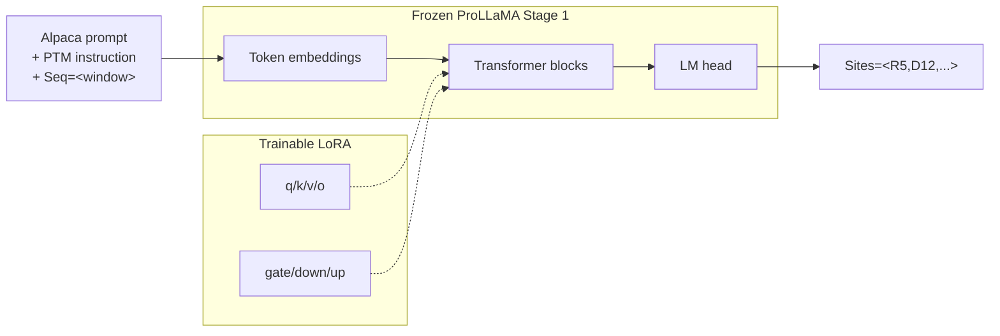
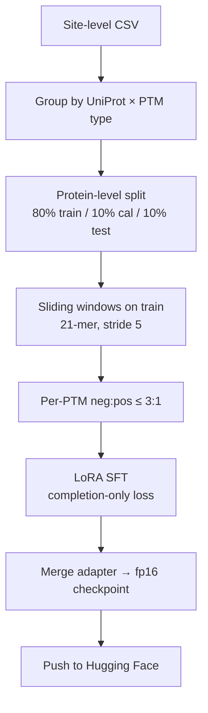
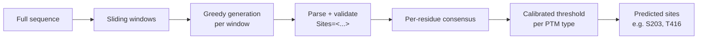
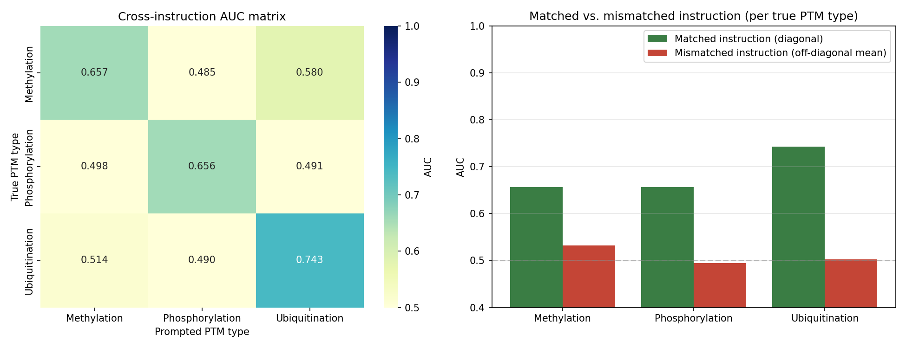

# ptm-llama

**ptm-llama** is an instruction-tuned protein language model that predicts post-translational modification (PTM) sites from primary sequence. Built on [ProLLaMA Stage 1](https://huggingface.co/GreatCaptainNemo/ProLLaMA_Stage_1) with a single LoRA adapter, it jointly handles **methylation**, **phosphorylation**, and **ubiquitination** — the PTM type is selected only through the natural-language instruction at inference time, with no task-specific classification heads.

Weights, calibrated thresholds, and full metrics live on [Hugging Face](https://huggingface.co/jbenbudd/ptm-llama). An interactive demo (sequence → sites + optional 3D structure) is available as a [Hugging Face Space](https://huggingface.co/spaces/jbenbudd/ptm-llama). Training and evaluation are implemented in `training/train_ptm_llama.ipynb` and `evaluation/evaluate_ptm_llama.ipynb`.

## Architecture

ptm-llama keeps ProLLaMA’s causal decoder intact and attaches one LoRA adapter over the attention and MLP projections (`q`, `k`, `v`, `o`, `gate`, `down`, `up`). Site prediction is cast as **structured generation**: given a short peptide window and a PTM-type instruction, the model emits positions in a shared format

```text
Sites=<K3,S12,...>
```

(residue letter + 1-indexed position within the window), or `Sites=<>` when no site is present. Task identity never enters the architecture — only the prompt.



| Component | Choice |
|---|---|
| Base model | `GreatCaptainNemo/ProLLaMA_Stage_1` |
| Adaptation | LoRA, r=64, α=128, dropout=0.05 |
| Objective | Completion-only SFT (`### Response:` masked via `DataCollatorForCompletionOnlyLM`) |
| Window / stride | 21 residues / 5 |
| PTM types | Methylation, Phosphorylation, Ubiquitination |

Example prompt (phosphorylation):

```text
Below is an instruction that describes a task. Write a response that appropriately completes the request.

### Instruction:
[Predict the phosphorylation sites given the peptide sequence]
Seq=<CQIVLTPELEGVEFALPKITR>

### Response:
Sites=<T16,...>
```

## Methodology

### Data and split

Source labels are long-format site annotations in `datasets/all_ptm_sites_site_level.csv` (one row per annotated site, with a per-protein binary mask). Records are grouped by `(uniprot_id, PTM_Type)`. Unique UniProt IDs are partitioned **protein-level** 80 / 10 / 10 into train / calibration / test (`SPLIT_SEED = 42`), so every annotation of a given protein falls in a single split and sequence-level leakage is avoided. The evaluation notebook re-derives the same calibration and test partitions from the same CSV and seed.

### Training

Train proteins are expanded into overlapping 21-residue windows (stride 5, plus a tail window for full coverage). Each window becomes one Alpaca-style example whose instruction is selected by PTM type. Windows with no in-window site of that type are retained as negatives (`Sites=<>`).

Because site prevalence differs sharply across PTM types, negatives are capped at a **3:1 negative:positive ratio per PTM type** on both the training fold and the early-stopping validation fold. Relative abundance *across* PTM types remains natural (phosphorylation ≫ ubiquitination ≫ methylation); only within-type imbalance is controlled. This prevents rare instructions (especially methylation) from collapsing to always-empty predictions, and keeps `eval_loss` aligned with site discrimination rather than empty-prior memorization.



Training uses AdamW (lr `1e-4`, cosine schedule, 200-step warmup), effective batch size 128, bf16, early stopping on `eval_loss`, and a hard cap of 10k optimizer steps. The best checkpoint is merged into the base weights and uploaded to the Hub.

### Inference

Full-protein prediction for a chosen PTM type:

1. **Slide** 21-residue windows (stride 5, with a tail window).
2. **Generate** `Sites=<...>` under that PTM’s instruction; validate each predicted letter against the window sequence and map hits to full-protein coordinates.
3. **Aggregate** a per-residue consensus score  
   `(# windows calling the residue a site) / (# windows covering the residue)`.
4. **Threshold** with a PTM-specific operating point chosen on the calibration set (F1-optimal over the consensus ROC) and then **locked** before test evaluation.



The Space and the eval notebook both load `inference_config.json` from the model repo (window size, stride, prompt template, instructions, consensus thresholds), so demo behavior stays synchronized with reported metrics.

### Evaluation

Calibration and test are disjoint protein-level holds. Thresholds are fit on calibration only; test metrics (AUC, precision, recall, F1, confusion matrices, per-residue breakdowns for canonical targets such as S/T/Y and K/R) are therefore unbiased point estimates. Full numbers and figures are on the [model card](https://huggingface.co/jbenbudd/ptm-llama).

A **cross-instruction ablation** asks whether the prompt actually steers the model: the same test sequences are run under all three PTM instructions, and AUC is scored against each PTM’s ground truth. A working instruction-tuned model should peak on the diagonal (matched instruction) and fall near chance off-diagonal.



## Repository layout

```text
training/train_ptm_llama.ipynb      # LoRA SFT, merge, Hub upload
evaluation/evaluate_ptm_llama.ipynb # calibrate, test, ablation, model card
app.py                              # Gradio Space (consensus inference + ESMFold view)
datasets/                           # site-level source CSV (not in git)
figures/                            # paper-facing figures
```

## Citations

```bibtex
@article{lv2024prollama,
  title   = {ProLLaMA: A Protein Large Language Model for Multi-Task Protein Language Processing},
  author  = {Lv, Liuzhenghao and Lin, Zongying and Li, Hao and Liu, Yujie and Cui, Jiaxi and Chen, Calvin Yu-Chian and Yuan, Li and Tian, Yonghong},
  journal = {arXiv preprint arXiv:2402.16445},
  year    = {2024}
}
```
